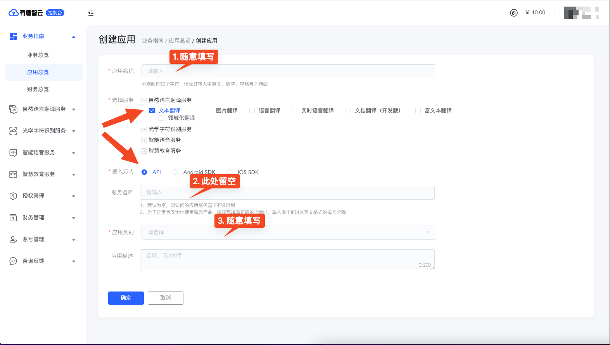
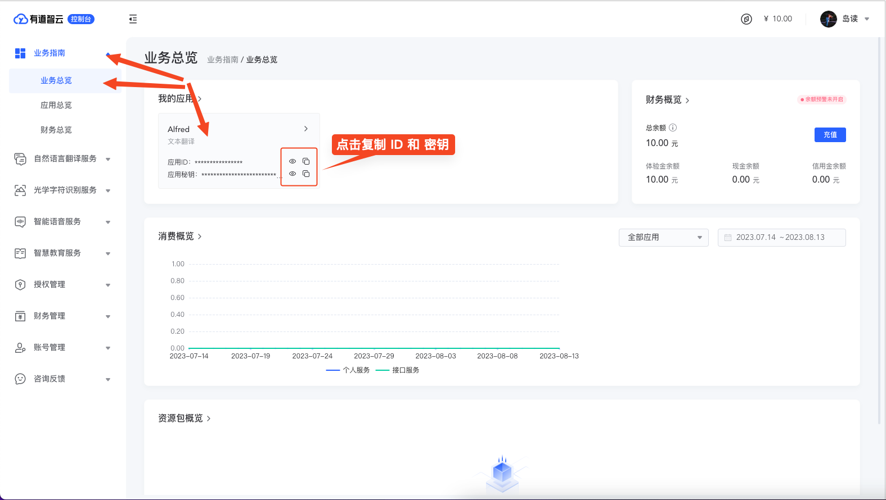
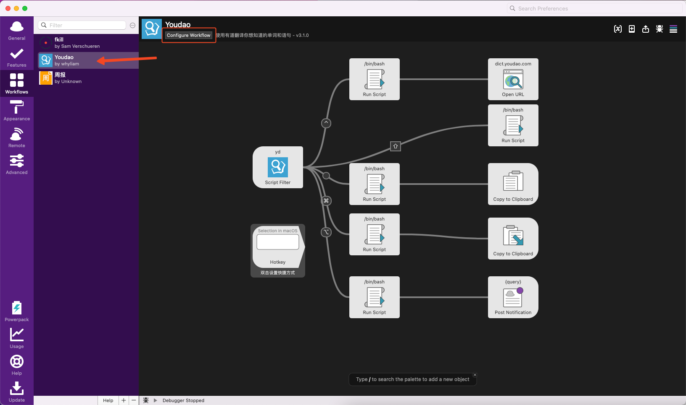
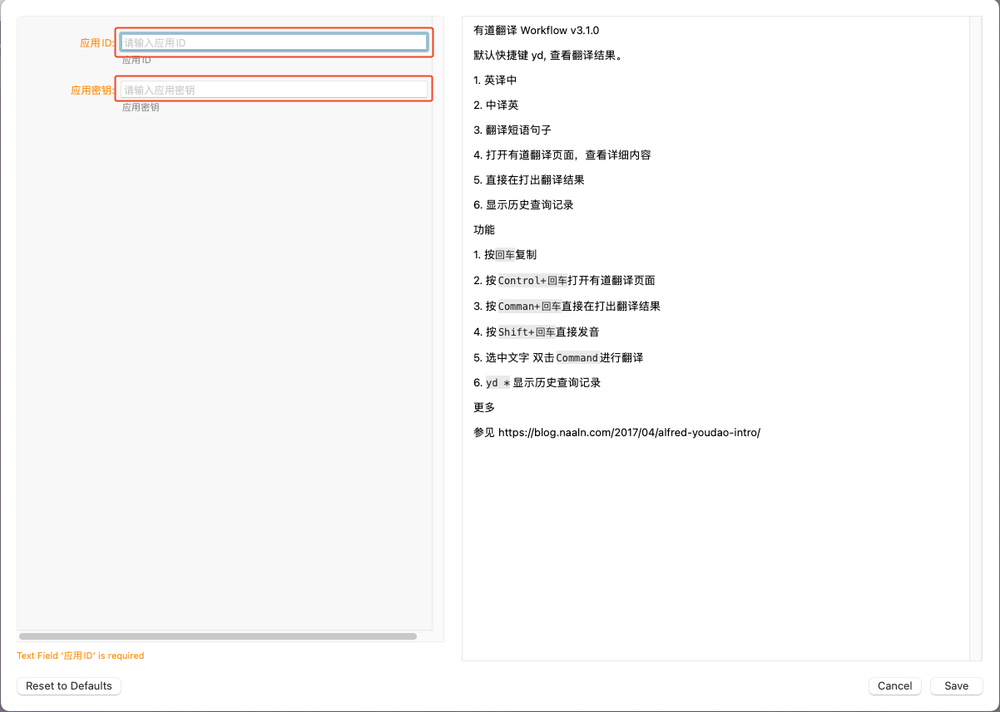

# 有道翻译

> 注意
>
> 本文信息可能会过时，仅供参考，请以服务商最新官方文档为准。
>
> 官方文档：[https://ai.youdao.com/doc.s#guide在新窗口打开](https://ai.youdao.com/doc.s#guide)

## [#](https://bobtranslate.com/service/translate/youdao.html#_0-收费模式)0. 收费模式

[查看详情在新窗口打开](https://ai.youdao.com/DOCSIRMA/html/自然语言翻译/产品定价/文本翻译服务/文本翻译服务-产品定价.html)

| 服务             | 免费额度 | 超出免费额度    | 并发请求数 |
| :--------------- | :------- | :-------------- | :--------- |
| 中文与语种一互译 | 无       | 48元/100万字符  | -          |
| 中文与语种二互译 | 无       | 100元/100万字符 | -          |
| 其他语种间互译   | 无       | 100元/100万字符 | -          |

> 提示
>
> 新注册用户领100元体验金
>
> 新用户注册即免费获得10元体验金，实名认证通过再获得40元体验金，添加客服微信再得50元体验金！

## [#](https://bobtranslate.com/service/translate/youdao.html#_1-注册登录)1. 注册登录

[点击此处跳转网页在新窗口打开](https://ai.youdao.com/)

> 注册完成后，按照页面提示添加有道客服微信并发送账号信息，可再获得50元体验金。

## [#](https://bobtranslate.com/service/translate/youdao.html#_2-创建应用)2. 创建应用

登录完成后，进入 [「业务指南-应用总览」在新窗口打开](https://ai.youdao.com/console/#/app-overview)，点击「创建应用」

应用名称随意填写，服务需勾选「文本翻译」，并按需勾选「语音合成」，接入方式选「API」，应用类别可随意选择，其他信息不用填，然后点击「确定」

在翻译单词时，有道翻译可以为单词提供额外的美音和英音发音。如希望使用有道提供的发音功能，此处需同时勾选「语音合成」。语音合成是收费服务，会单独按发音使用量计费，详见 [「智能语音合成服务-产品定价」在新窗口打开](https://ai.youdao.com/DOCSIRMA/html/语音合成TTS/产品定价/语音合成服务/语音合成服务-产品定价.html)

> 注意
>
> 请不要填写「服务器 IP」这一项设定，填写后很可能会导致你无法正常访问服务。

## [#](https://bobtranslate.com/service/translate/youdao.html#_3-获取秘钥)3. 获取秘钥

> 警告
>
> **前面的步骤，只要没明确说可以跳过，那就是不能跳过的，不然获取到秘钥也用不了！**

此外，请妥善保管自己的秘钥，秘钥泄露可能会给你带来损失！

进入 [「业务指南-业务总览」在新窗口打开](https://ai.youdao.com/console/#/)，在「我的应用」中找到开通了「文本翻译」服务的应用，点击「应用 ID」和「应用密钥」旁的复制按钮可分别复制所需的应用 ID 和应用密钥

## 4. 填写秘钥

在 Alfred 的 Workflows 中，选中「Youdao」，点击 `Configure Workflow` 。

然后将刚才获取到的应用 ID 和应用密钥填写到对应位置即可。

## 5. 错误说明

如果新版本有道智云遇到问题，请参见 [错误代码列表](https://ai.youdao.com/DOCSIRMA/html/trans/api/wbfy/index.html#section-14)。
